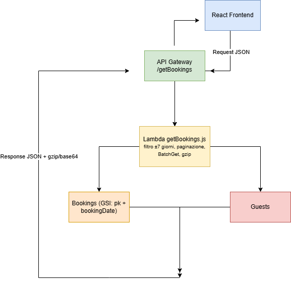

# AWS Serverless Booking Engine & Data Optimizer

## Live demo:
👉 https://cosmic-tartufo-e50434.netlify.app

## 🖼️ **Architettura**


Questa piattaforma gestisce flussi di prenotazioni tramite un backend serverless (AWS Lambda + API Gateway + DynamoDB) e un frontend React + Redux. 

Il sistema è progettato per scalabilità estrema, utilizzando paginazione server-side e Global Secondary Index (GSI) per eliminare colli di bottiglia e ottimizzare i costi operativi.

---

## 🖼️ **Anteprima Dashboard**


---

Panoramica db  
  
  


Lambda ed Api  
  
  


👉 [Scarica la Documentazione Tecnica Completa (PDF)](./docs/ProjectAWS.pdf)

---

## Architettura e Scelte Tecniche

### DynamoDB e Global Secondary Index (GSI)

La tabella Bookings utilizza un Global Secondary Index (GSI) progettato per supportare query temporali efficienti:

- pk (partition key): valore fisso (allBookings)
- bookingDate (sort key)

Questa struttura consente di eseguire query mirate su intervalli di date, evitando operazioni di Scan costose e poco scalabili, migliorando sia le performance sia i costi di utilizzo di DynamoDB.

---

### Filtro temporale

Il backend restituisce esclusivamente le prenotazioni comprese in un intervallo di ±7 giorni rispetto alla data corrente.

Benefici:

- riduzione della dimensione del payload
- limitazione degli item letti
- minore carico sul frontend

---

### Backend – getBookings.js

Funzionalità principali:

- Query DynamoDB tramite GSI
- Paginazione lato server (Limit, ExclusiveStartKey)
- Recupero guest tramite BatchGet
- Arricchimento risultati con dati correlati
- Compressione gzip della risposta

Vantaggi:

- miglioramento performance
- riduzione costi
- payload ottimizzato
- stabilità con dataset grandi

---

### Sicurezza AWS

#### Sviluppo locale
Credenziali in `.env` utilizzate solo per:

- seed database
- test locali
- validazione logica

#### Produzione (IAM Role)
Accesso tramite role con:

- least privilege
- permessi limitati
- nessuna credenziale hardcoded

---

## 📂 Struttura del progetto


progetto/
│
├─ backend/
│ ├─ getBookings.js
│ ├─ seed.js
│ ├─ package.json
│ └─ .env
│
└─ frontend/
├─ src/
├─ components/
└─ ...


---

## 🛠️ Prerequisiti

- Node.js v18+
- AWS Account
- DynamoDB
- AWS Lambda
- API Gateway

Tabelle:

- Bookings
- Guests

---

## ⚙️ Setup Backend

```bash
cd backend
npm install

Creare .env:

AWS_ACCESS_KEY_ID=TUO_ACCESS_KEY_ID
AWS_SECRET_ACCESS_KEY=TUO_SECRET_ACCESS_KEY
AWS_REGION=eu-north-1

Popolare database:

node seed.js

Deploy:

Lambda: getBookings.js

API Gateway: POST /getBookings

⚡ Setup Frontend
cd frontend
npm install
npm start

Dashboard:

👉 http://localhost:3000

🔄 Flusso Applicativo

Backend:

query paginata

filtro temporale

batch get guest

lastKey per continuazione

Frontend:

fetch con lastKey

Redux store

load more

rendering progressivo

🛠️ Problemi Risolti
Problema	Soluzione
Payload troppo grande	paginazione + gzip
Troppe query guest	BatchGet
Query lente	GSI
Dataset non rilevante	filtro
Crash UI	gestione paginazione
🧪 Testing

Deploy backend

Avvia frontend

Naviga dashboard

Load more

Verifica logs

📌 Note Finali

backend stateless

query ottimizzate

best practice AWS

architettura estensibile

License

MIT License

Copyright (c) 2026 Primula Robustelli

Permission is granted to use this software for personal demonstration purposes.

Commercial use, redistribution, or modification is not permitted without authorization.