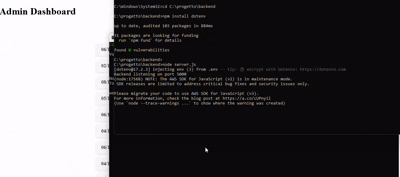
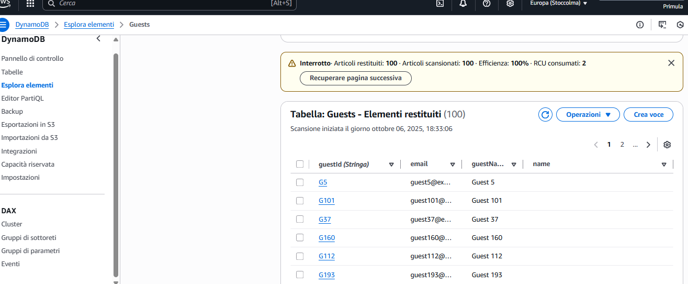
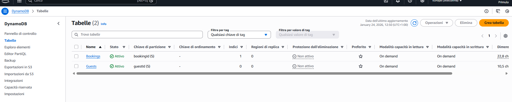
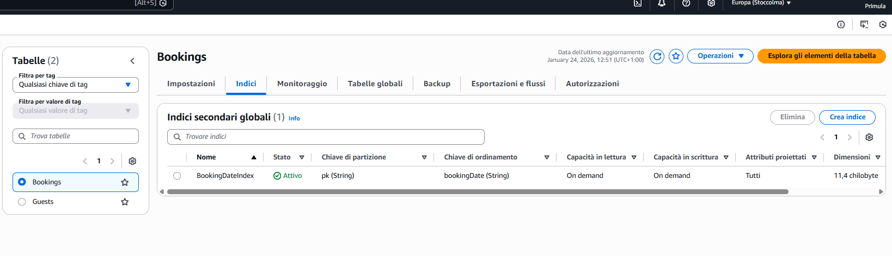
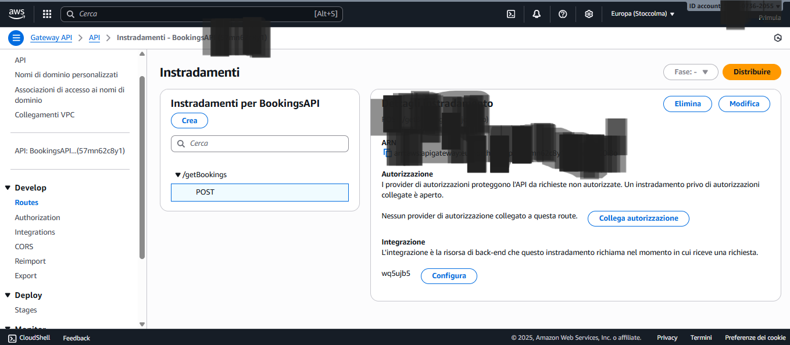
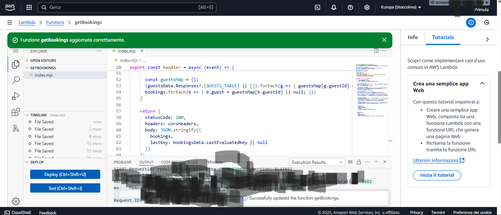
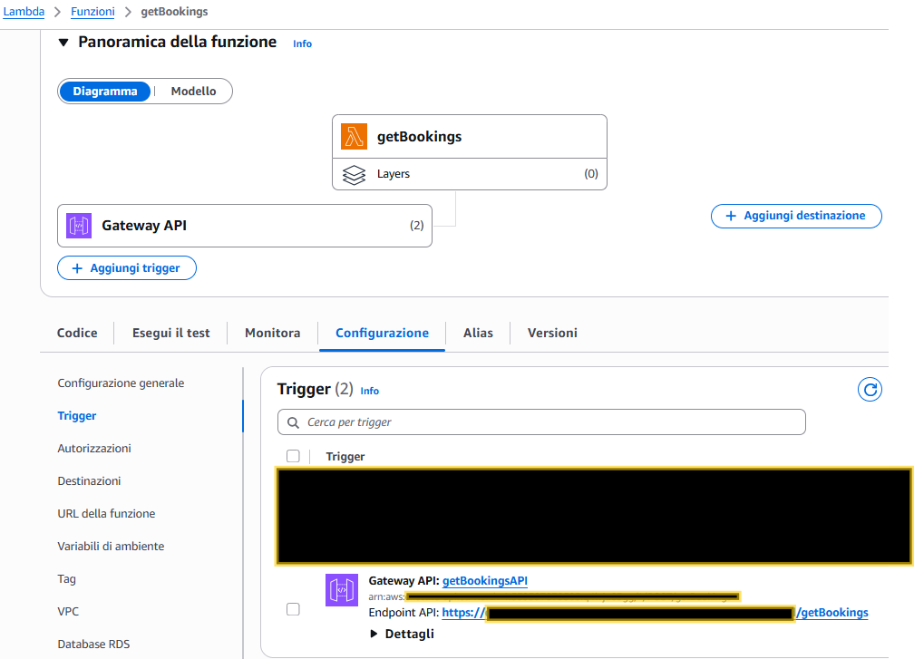

# Property Management Platform / Admin Dashboard

## Live demo:
👉 https://cosmic-tartufo-e50434.netlify.app

Questa piattaforma consente di gestire le prenotazioni degli ospiti tramite un backend serverless (AWS Lambda + API Gateway + DynamoDB) e un frontend React + Redux.

Il sistema è progettato per essere scalabile ed efficiente, utilizzando paginazione lato backend e Global Secondary Index (GSI) per evitare payload troppo grandi e query inefficienti.
---

## 🖼️ **Anteprima Dashboard**

---
Panoramica db

Lambda ed Api

Architettura e Scelte Tecniche
DynamoDB e Global Secondary Index (GSI)

La tabella Bookings utilizza un Global Secondary Index (GSI) progettato per supportare query temporali efficienti:

pk (partition key): valore fisso (allBookings)

bookingDate (sort key)

Questa struttura consente di eseguire query mirate su intervalli di date, evitando operazioni di Scan costose e poco scalabili, migliorando sia le performance sia i costi di utilizzo di DynamoDB.

Filtro temporale

Il backend restituisce esclusivamente le prenotazioni comprese in un intervallo di ±7 giorni rispetto alla data corrente.

Questo approccio permette di:

ridurre la dimensione del payload restituito

limitare il numero di item letti da DynamoDB

diminuire il carico di elaborazione sul frontend

Backend – getBookings.js
Funzionalità principali

Query DynamoDB tramite GSI, ottimizzata per accesso per data

Paginazione lato backend mediante:

Limit

ExclusiveStartKey

Recupero dati guest con BatchGet

una singola chiamata DynamoDB per ottenere tutti i guest associati alle prenotazioni

Arricchimento dei risultati

ogni booking viene associata ai dati del relativo guest

Compressione gzip della risposta

riduzione significativa della dimensione del payload

miglioramento delle performance di rete

Compatibilità con API Gateway

risposta codificata in base64

header Content-Encoding: gzip

Compressione gzip

Il flusso di risposta del backend è il seguente:

serializzazione dei dati in formato JSON

compressione tramite zlib.gzipSync

codifica in base64 (richiesta da API Gateway)

restituzione della risposta con header:

Content-Encoding: gzip

Questa strategia consente di:

migliorare i tempi di risposta

ridurre i costi di trasferimento dati

aumentare la stabilità dell’applicazione in presenza di payload medi o grandi

Sicurezza AWS – Evoluzione
Fase 1 – Sviluppo locale

Nella fase iniziale di sviluppo sono state utilizzate le seguenti variabili di ambiente:

AWS_ACCESS_KEY_ID

AWS_SECRET_ACCESS_KEY

AWS_REGION

Definite nel file .env, esclusivamente per:

popolamento di DynamoDB tramite script di seed

test locali

validazione della logica applicativa

Questa configurazione è stata utilizzata solo in ambiente di sviluppo e non è mai stata esposta al frontend.

Fase 2 – Produzione (Best Practice)

In ambiente di produzione il backend utilizza un approccio basato su IAM Role, in linea con le best practice AWS:

IAM Role associato direttamente alla funzione Lambda

Policy configurata secondo il principio del least privilege

Permessi concessi esclusivamente per:

operazioni DynamoDB:

Query

BatchGetItem

GetItem

risorse autorizzate:

tabella Bookings

tabella Guests

In questa configurazione:

nessuna Secret Key è presente nel codice

nessuna credenziale è esposta

l’autenticazione avviene automaticamente tramite IAM Role

## 📂 **Struttura del progetto**

progetto/
│
├─ backend/
│  ├─ getBookings.js       # Lambda function per leggere bookings da DynamoDB con paginazione e batchGet guests
│  ├─ seed.js              # Script opzionale per popolare DynamoDB con dati di test
│  ├─ package.json
│  └─ .env                 # Credenziali AWS (Access Key, Secret Key, Region)
│
└─ frontend/
   ├─ src/
   │  ├─ redux/
   │  │  └─ bookingsSlice.js  # Redux slice con fetchBookings e gestione paginazione
   │  ├─ components/
   │  │  └─ BookingList.js    # Componente React per visualizzare bookings
   │  ├─ App.js
   │  └─ ... altri componenti
   ├─ package.json
   └─ ...

---
🛠️ Prerequisiti

Node.js v18+

AWS Account

DynamoDB

AWS Lambda

API Gateway

Tabelle DynamoDB

Bookings

Guests

⚙️ Setup Backend (sviluppo locale)
cd backend
npm install

Creare .env:

AWS_ACCESS_KEY_ID=TUO_ACCESS_KEY_ID
AWS_SECRET_ACCESS_KEY=TUO_SECRET_ACCESS_KEY
AWS_REGION=eu-north-1

Popolare il database:

node seed.js

Deploy:

caricare getBookings.js su AWS Lambda

configurare API Gateway → POST /getBookings

⚡ Setup Frontend
cd frontend
npm install
npm start

Dashboard disponibile su:
👉 http://localhost:3000

🔄 Flusso Applicativo
Backend

Query bookings paginata

Filtro date ±7 giorni

BatchGet guest

Restituzione lastKey

Frontend

fetchBookings(lastKey)

Accumulo prenotazioni in Redux

Bottone Load More

Rendering progressivo

🛠️ Problemi Risolti
Problema	Soluzione
HTTP 413 Payload Too Large	Paginazione backend + gzip
Troppe query guest	BatchGet DynamoDB
Query lente	GSI su bookingDate
Prenotazioni non rilevanti	Filtro ±7 giorni
Crash Redux	Fallback `bookings
🧪 Testing

Avvia backend (Lambda + API Gateway)

Avvia frontend React

Apri dashboard

Carica pagine successive con Load More

Verifica CloudWatch logs

📌 Note Finali

Il backend è stateless e scalabile

Le query DynamoDB sono ottimizzate per costo e performance

Il progetto segue best practice AWS reali, non solo demo

Struttura pensata per estensione futura (auth, filtri avanzati, caching)